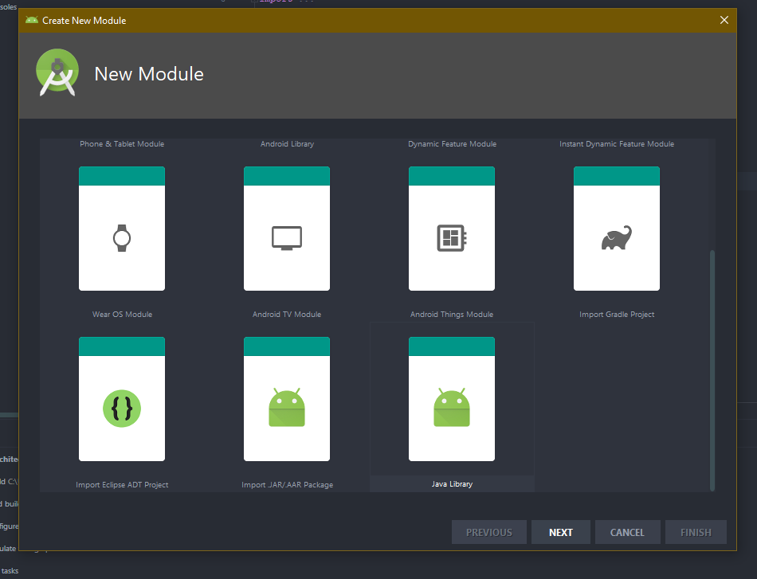

# Android Architecture

## Clean Architecture
You might be wondering: Why should I use an architecture? I’m better than that. Well, bear with me.

# Why Architecture Is Important
All architectures have one common goal — to manage the complexity of your application. You may not need to worry about it on a smaller project, but it becomes a lifesaver on larger ones.

How does Clean Architecture approach the problem?

You might have seen this graph already:

The circles represent different levels of software in your app. There are two key things to note:

The center circle is the most abstract, and the outer circle is the most concrete. This is called the Abstraction Principle. The Abstraction Principle specifies that inner circles should contain business logic, and outer circles should contain implementation details.
Another principle of Clean Architecture is the Dependency Rule. This rule specifies that each circle can depend only on the nearest inward circle — this is what makes the architecture work.

# SOLID Principles
  
  Five design principles make software design more understandable, flexible and maintainable. Those principles are:

* Single Responsibility: Each software component should have only one reason to change – one responsibility.

* Open-closed: You should be able to extend the behavior of a component, without breaking its usage, or modifying its extensions.

* Liskov Substitution: If you have a class of one type, and any subclasses of that class, you should be able to represent the base class usage with the subclass, without breaking the app.

* Interface Segregation: It’s better to have many smaller interfaces than a large one, to prevent the class from implementing the methods that it doesn’t need.

* Dependency Inversion: Components should depend on abstractions rather than concrete implementations. Also higher level modules shouldn’t depend on lower level modules.

## Layers of Clean Architecture

* Presentation: A layer that interacts with the UI.

* Use cases: Sometimes called interactors. Defines actions the user can trigger.

* Domain: Contains the business logic of the app.

* Data: Abstract definition of all the data sources.

* Framework: Implements interaction with the Android SDK and provides concrete implementations for the data layer.

Right click on AndroidArchitecture in Project explorer and select New ▸ Module or select File ▸ New ▸ New Module.

In the wizard, select Java library and click “Next”.

Under Library name, type data.

